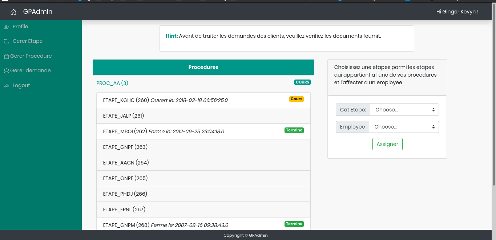

# GPADMIN (Administrative processes manager)

## Description

Generale purpose platform to manage and handle adminstrative process by supervisor/employee for clients.

Each administrtive process is a representation of multiple steps, each step is handled by a single employee.

**Supervisor**

Supervisor is handling administrative process, assigning employees, validating clients requests ...

A supervisor may handle multiple process at once, he can also do the job of employee.

**Employee**

Employee is managing steps in a process, he could validate, refuse / reject or delay (needed some documents).

Every decision need to be justifed by a report before moving to the next step.

An employee can handle multiple steps of multiple processes.

**Client**

A client can make a request from a certain process provided by the platfrom, a token will be generated in order to keep
track of the process and its status.

Every new request is in pending state, waiting for the supervisor to validate.

The client is not required to create an account or something similar, only his card id is required

## Technology / Dependencies

Needed libraries are placed inside: *web/WEB-INF/lib*

* mysql-connector : mysql driver for jdbc
* jstl: jstl library for web pages
* gson: gson library for handing json interaction and APIs

## Screenshost

